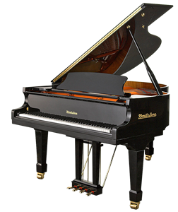

# How to Edit Your Website

This guide explains how to update your site yourself, directly on GitHub.
**No software to install.** After any change, your site updates in about 1 minute.

---

## ⭐ The one skill you need: editing a file on GitHub

1. Go to your repo: **https://github.com/tjjbanana/cremonamusic2**
2. Click the file you want to change (for text edits, that's usually `index.html`)
3. Click the **pencil icon ✏️** in the top-right corner ("Edit this file")
4. Make your change in the text
5. Scroll to the bottom and click the green **"Commit changes"** button
6. Click **"Commit changes"** again in the popup
7. Wait ~1 minute, then refresh your website to see it

> 💡 **Tip:** If you make a mistake, GitHub keeps every old version. You can always undo. Nothing is ever truly lost.

---

## 📸 1. Replacing a photo (EASIEST — no code)

The trick: **give the new photo the exact same filename as the old one.**
Because the website already points to that filename, it just swaps automatically.

### Photo filenames on your site:
| What it is | Filename |
|---|---|
| Achievement photos | `achievement_1.jpg` → `achievement_4.jpg` |
| Event photos | `event_1.jpg`, `event_2.jpg`, `event_3.jpg` |
| Carousel (slideshow) | `carousel_1.jpg` → `carousel_9.jpg` |
| Hero (top background) | `hero_bg.jpg` |
| Recital hall | `recital.jpg` |
| Shop photos | `shop_strings.jpg`, `shop_piano.jpg` |
| Logo | `logo.png`, `logo_mobile.png` |

### Steps to replace a photo:
1. On your computer, **rename your new photo** to match exactly (e.g. `achievement_2.jpg`)
2. On GitHub, click into the **`images`** folder, then **`photos`**
3. Click **"Add file"** → **"Upload files"**
4. **Drag your new photo** into the box
5. Click **"Commit changes"**
6. It overwrites the old one. Done!

> ⚠️ The filename must match **exactly**, including `.jpg` vs `.png`. `event_1.jpg` ≠ `event_1.JPG` ≠ `event1.jpg`.
>
> 💡 If the old photo still shows after a minute, your browser is remembering it. Press **Ctrl+Shift+R** to force a refresh.

---

## 🎫 2. Editing an EVENT (text + photo)

Events live in **`index.html`**. Each event is a block that looks like this:

```html
      <div class="event-card">
        <div class="event-date">Oct</div>
        <span class="event-month">2025</span>
        
        <h3>Masterclass with Prof. Jaz Tan</h3>
        <p></p>
      </div>
```

- **Month** → change `Oct` to `Dec`, etc.
- **Year** → change `2025`
- **Title** → change the text between `<h3>` and `</h3>`
- **Description** → type between `<p>` and `</p>` (currently empty)
- **Photo** → change `event_1.jpg` to a different filename, OR just replace the photo using Section 1

---

## ➕ 3. Adding a NEW event

1. Edit **`index.html`** (pencil ✏️)
2. Find the **last** event block (the one ending with `</div>` before the `📢 Follow us...` line)
3. **Copy a whole event block** — everything from `<div class="event-card">` to its matching `</div>`
4. **Paste it right below** the last event block
5. Change the month, year, title, and photo filename in your new copy
6. Upload a new photo named e.g. `event_4.jpg` (see Section 1)
7. Commit changes

> 💡 **Golden rule:** always *copy an existing block* and edit it. Never type a block from scratch — copying keeps all the punctuation correct.

---

## 🎵 4. Editing a LESSON CARD (text + photo)

Lesson cards are in **`index.html`**. Each looks like this:

```html
      <div class="lesson-card">
        <span class="lesson-icon"></span>
        <h3><span data-en="">Piano</span><span data-zh="">鋼琴</span></h3>
        <p><span data-en="">Classical piano education for children and adults. </span><span data-zh="">適合兒童和成人的古典鋼琴教育。</span></p>
        <span class="lesson-badge"><span data-en="">Age 4 and above · One-on-One · All Levels</span><span data-zh="">4歲以上 · 一對一 · 所有程度</span></span>
        ...
      </div>
```

**Your site is bilingual.** Each piece of text appears twice:
- `data-en=""` → the **English** version
- `data-zh=""` → the **Chinese** version

To change the English, edit the words after `data-en="">`.
To change the Chinese, edit the words after `data-zh="">`.
**Edit both** so the two languages stay in sync.

- **Card photo (icon)** → the `images/icons/...` file. Replace it the same way as Section 1, but in the **`images/icons`** folder, keeping the same filename.

> 📝 **Note:** When someone *taps* a lesson card, a popup with a longer description appears.
> That longer text lives in a different file: **`js/script.js`**. The format is the same
> (an English version and a Chinese version) — just look for the lesson name (e.g. `violin:`)
> and edit the `desc:` and `features:` lines.

---

## 🏆 5. Replacing an achievement photo

Achievements are **just photos**, no text. Easiest of all:
- Replace `achievement_1.jpg` (through `achievement_4.jpg`) using **Section 1**. That's it.

To add a *new* achievement (a 5th one), it's like adding an event — copy an
achievement line in `index.html` and point it at a new photo:
```html
      <div class="achievement-card"></div>
```

---

## ✅ Quick reference

| I want to... | Where | Need code? |
|---|---|---|
| Swap any photo | Upload with same filename | ❌ No |
| Change event text | `index.html` | ✏️ A little |
| Add an event | `index.html` (copy a block) | ✏️ A little |
| Change lesson card text | `index.html` (edit en + zh) | ✏️ A little |
| Change lesson popup text | `js/script.js` | ✏️ A little |
| Replace achievement photo | Upload with same filename | ❌ No |

**Remember:** every change is saved forever and can be undone. You can't permanently break anything.
